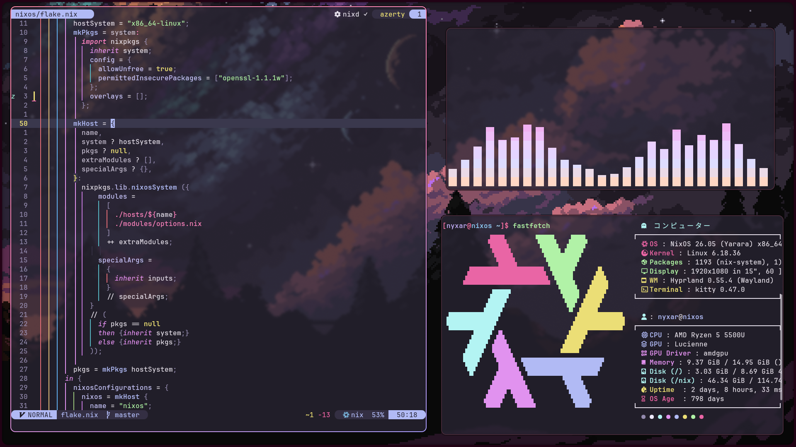

# homeconfig

My Home Manager configuration for Hyprland and Caelestia.

## Screenshots

## Desktop

- Hyprland
- Caelestia Shell
- Wofi theme and clipboard pickers
- Kitty, Zsh, Starship, and tmux
- Firefox with declarative extensions and settings
- dynamic dark/light modes
- tonalspot and vibrant palettes
- wallpaper rotation that preserves the selected mode and palette
- shared colors across GTK 3, GTK 4, Qt, LibreOffice, PrismLauncher, Swappy,
  pavucontrol-qt, MPV, Cava, Btop, and Vesktop

GTK receives colors only. Adwaita and libadwaita still handle widget styling,
spacing, and typography.

## Keybinds

| Keybind             | Action            |
| ------------------- | ----------------- |
| `Super + Space`     | Launcher          |
| `Super + T`         | Theme picker      |
| `Super + Shift + W` | Next wallpaper    |
| `Super + M`         | Screenshot        |
| `Super + Shift + M` | Frozen screenshot |
| `Super + J`         | Clipboard history |
| `Super + P`         | Projector panel   |
| `Super + A`         | Dashboard         |
| `Super + N`         | Sidebar           |
| `Super + X`         | Session menu      |
| `Super + L`         | Lock              |

- `modules` contains individual programs and desktop behavior
- `profiles` groups modules by machine role
- `users` selects the profiles and user-specific packages
